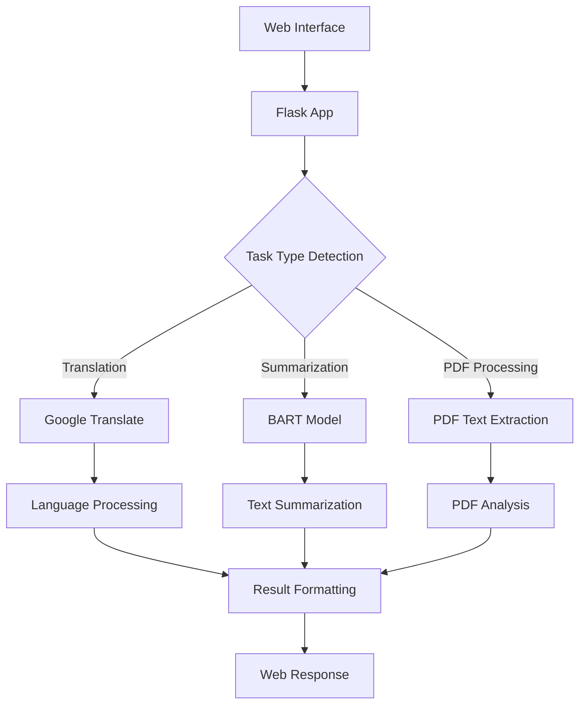
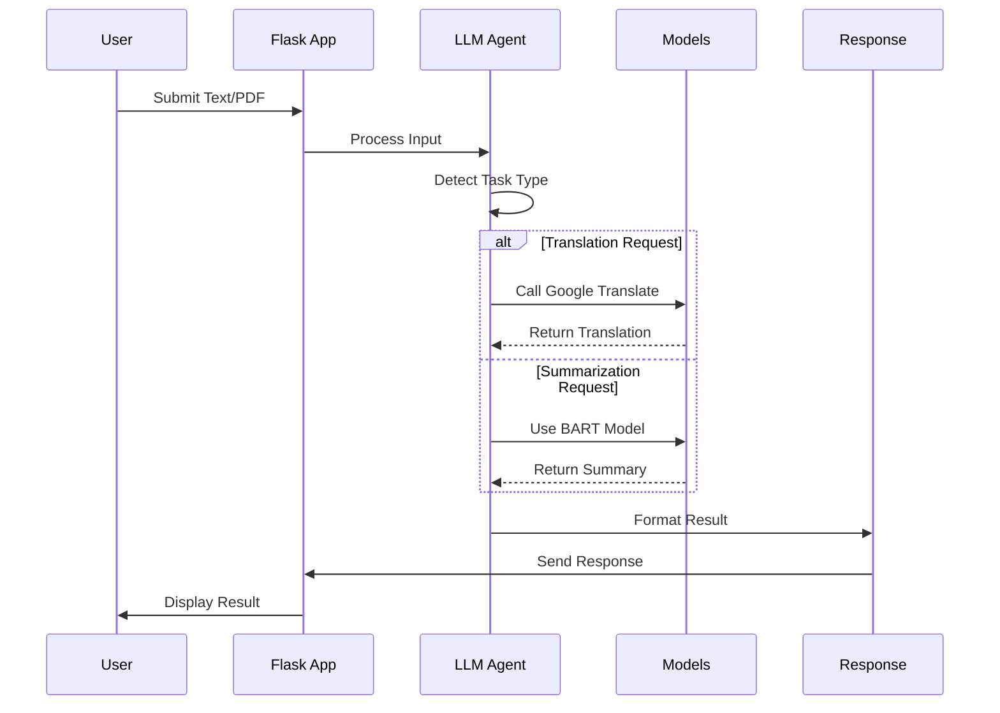

# 🤖 LLM Agent - Intelligent Text Processing System

A Flask-based web application that provides intelligent text processing capabilities using Language Models and various NLP tools. The system can perform multiple tasks including summarization, translation, and PDF text analysis.

## 🌟 Features

- **Text Summarization**: Uses BART model (facebook/bart-large-cnn) for generating concise summaries
- **Language Translation**: Integrates Google Translate for multi-language support
- **PDF Text Processing**: Extracts and processes text from PDF documents
- **Intelligent Task Detection**: Automatically detects whether to summarize or translate based on input
- **Web Interface**: User-friendly Flask web interface for easy interaction
- **Flexible Processing**: Handles both direct text input and file uploads

## 🏗️ Architecture



## 🔄 Process Flow



## 🛠️ Installation

1. Clone the repository:
   ```bash
   git clone https://github.com/0Tarun0709/LLM-AGENT-Dynamic-Large-Language-Model-LLM-Task-Orchestrator.git
   cd LLM-AGENT-Dynamic-Large-Language-Model-LLM-Task-Orchestrator
   ```

2. Create a virtual environment:
   ```bash
   python -m venv venv
   source venv/bin/activate  # Linux/Mac
   .\venv\Scripts\activate   # Windows
   ```

3. Install required packages:
   ```bash
   pip install flask transformers googletrans==3.1.0a0 langchain torch pandas matplotlib seaborn PyMuPDF sumy nltk
   ```

4. Download NLTK data:
   ```python
   import nltk
   nltk.download('punkt')
   ```

## 🚀 Quick Start

1. Start the Flask application:
   ```bash
   python app.py
   ```

2. Access the web interface in your browser at `http://localhost:5000`

3. Use the system:
   - For translation: Enter text with "translate to [language]" prefix
   - For summarization: Enter any text without translation command
   - For PDF processing: Upload a PDF file using the provided interface

Example usage in code:
```python
from app import LLM_agent

# For translation
result = LLM_agent("translate to spanish Hello, how are you?")
print(result)

# For summarization
text = "Your long text here..."
summary = LLM_agent(text)
print(summary)
```

## 🧩 Components

1. **Flask Web Application**
   - User interface for text input
   - File upload handling
   - Result display

2. **LLM Agent**
   - Task type detection
   - Input processing
   - Response formatting

3. **NLP Models**
   - BART model for summarization
   - Google Translate for translation
   - PDF text extraction utilities

4. **Helper Functions**
   - Language detection
   - Text preprocessing
   - Result formatting

## 📊 Key Functions

1. **Summarization**
   ```python
   def summarize(text):
       LLM = HuggingFacePipeline(pipeline=summarization_pipeline)
       data = "Summarize This Data in 2 to 5 sentences : " + text
       return LLM.invoke(data)
   ```

2. **Translation**
   ```python
   def translate(text, target_language='en'):
       translator = Translator()
       return translator.translate(text, dest=target_language).text
   ```

3. **Task Detection**
   ```python
   def LLM_agent(input_text):
       if 'translate' in input_text.lower():
           # Handle translation
           return translated_text
       else:
           # Handle summarization
           return summary
   ```

## 🧪 Testing

Run the test suite:
```bash
pytest tests/
```

## � Dependencies

- Flask
- Transformers
- Langchain
- Torch
- Pandas
- Matplotlib
- PyMuPDF
- NLTK
- Googletrans
- Seaborn


## Acknowledgments

- BART model from Facebook AI
- Hugging Face Transformers library
- Flask web framework
- Google Translate API


